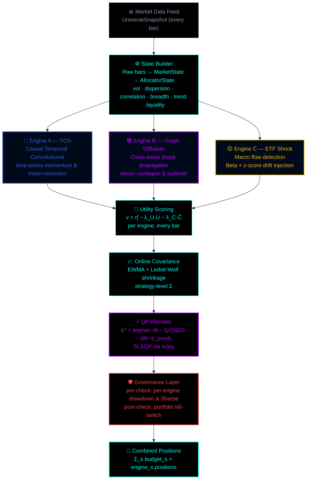

<div align="center">
  
</div>

<div align="center">
  <a href="#">
    
  </a>
</div>

<br/>

<div align="center">

[](https://python.org)
[](https://numpy.org)
[](https://scipy.org)
[](.)
[](LICENSE)

</div>

<br/>

```
╔══════════════════════════════════════════════════════════════════════════════╗
║  Three orthogonal engines. One quadratic programme. Hard governance.         ║
║  Built with $100,000 of live capital behind it.                              ║
╚══════════════════════════════════════════════════════════════════════════════╝
```

---

## `> PHILOSOPHY.exe`

Most algo systems rely on one model. When that model breaks — regime shift, edge decay, data anomaly — you lose.

The Sovereign Allocator runs **three engines that find edge in completely different ways**. A mathematical optimiser decides in real-time how much capital each engine deserves, punishing risk, cost, and poor recent performance. A hard governance layer overrides everything if the maths goes wrong.

```
One model dies  →  one engine disabled  →  two still running
All models die  →  kill switch fires    →  flat, waiting for recovery
```

---

## `> ARCHITECTURE.exe`



---

## `> THE_THREE_ENGINES.exe`

<details open>
<summary><b>🔵 Engine A — Causal TCN (Temporal / Time-Series Edge)</b></summary>

<br/>

**What it captures:** Patterns in a single asset's own price history — momentum, mean-reversion, autocorrelation regimes.

A causal dilated temporal convolutional network reads the last `L` bars and produces a probability distribution over `{short, flat, long}`:

```
P(r_{t+1} | r_t, r_{t-1}, ..., r_{t-L})
```

Causal = zero look-ahead leakage. Dilated convolutions exponentially expand the receptive field without parameter bloat.

**Out of the box:** a momentum-based stub (`_CausalTCNStub`). Plug in any PyTorch / MLX model:

```python
class MyModel:
    def predict_proba(self, returns: np.ndarray) -> np.ndarray:
        # returns: 1-D log-return array (newest last)
        # output:  np.array([p_short, p_flat, p_long])
        ...

TCNEngine(symbols=ASSETS, model=MyModel())
```

</details>

<details open>
<summary><b>🟣 Engine B — Graph Diffusion (Cross-Asset / Micro Edge)</b></summary>

<br/>

**What it captures:** How a shock in one asset ripples through correlated neighbours — sector spillovers, contagion, co-movement not explained by a single factor.

Assets are nodes. Rolling correlations above `min_edge_weight` become edges. Shocks propagate via:

```
H_t = (I + α · Ã)^K  ·  x_t

à = symmetrically normalised adjacency (correlation-based)
α = diffusion coefficient   (propagation speed)
K = diffusion steps         (neighbourhood depth)
x_t = current bar return vector (shock)
```

`H_t[i] > 0` → asset `i` dragged upward by its neighbours. Graph rebuilt every `graph_update_freq` bars.

</details>

<details open>
<summary><b>🟡 Engine C — ETF Shock Propagation (Macro / Top-Down Edge)</b></summary>

<br/>

**What it captures:** ETF flows and macro shocks cascading into individual assets.

```
1. shock detection   →  z_t^ETF = (r_t^ETF − μ) / σ   [trigger at |z| > 2.0]
2. beta estimation   →  β = Cov(r^asset, r^ETF) / Var(r^ETF)   [rolling OLS]
3. drift injection   →  drift_t = Σ_ETF  β × shock_amplitude
4. decay             →  signal tapers linearly over signal_decay bars
```

Large SPY inflow → lifts constituents. HYG dump → cascades into high-beta equities. This engine catches that before price fully adjusts.

</details>

---

## `> THE_MATH.exe`

### Utility scoring

Each engine `s` is scored every bar:

```
ν_t^s = η̂_t^s  −  λ_U · U_t^s  −  λ_C · Ĉ_t^s

η̂   = EWMA of realised PnL (annualised)  → recent performance
U   = risk penalty (vol × regime)         → penalise dangerous engines
Ĉ   = cost estimate (spread × churn)      → penalise expensive engines
```

An engine with positive edge but high risk and cost can still score negative → QP allocates it nothing.

### Quadratic programme

```
b* = argmax_b  [ ν^T b  −  (γ/2) b^T Σ b  −  λ_turn ‖b − b_{t-1}‖₁ ]

     s.t.   1^T b ≤ 1    (budgets ≤ 100%)
            b ≥ 0         (no shorting an engine)

ν^T b         →  reward high-utility engines
(γ/2)b^T Σ b  →  penalise correlated engine exposures
λ_turn ‖Δb‖₁  →  penalise thrashing allocations every bar
```

**Adaptive parameters:**
- `γ_t` scales with `volatility_regime` — more risk-averse in stressed markets
- `λ_turn` scales with `(1 − liquidity_score)` — higher turnover cost when illiquid

Solved with SLSQP (scipy). No external QP solver required.

### Online covariance (Σ)

3×3 strategy-level covariance from each engine's realised PnL stream. EWMA for recency-weighting, Ledoit-Wolf constant-correlation shrinkage for stability on short windows.

---

## `> GOVERNANCE.exe`

Hard rules. The maths never gets final say.

```
PRE-CHECK  (per engine, before QP)
──────────────────────────────────
Engine drawdown ≥ 5%         →  utility = 0  (QP allocates nothing)
Negative Sharpe for 10 bars  →  utility × 0.5  (degraded, not killed)

POST-CHECK  (portfolio level, after QP)
────────────────────────────────────────
Portfolio drawdown ≥ 10%     →  KILL SWITCH
                                all budgets = 0
                                all positions = flat
                                no reentry until NAV recovers

Recovery condition:
  NAV ≥ peak × (1 − max_drawdown × recovery_factor)
  Prevents re-entering a collapsing market on a dead-cat bounce.
```

---

## `> QUICKSTART.exe`

```bash
# Install
pip install -e .

# Run smoke tests (all 6 should pass)
python -m pytest tests/ -v

# Run 500-bar synthetic backtest
python run_backtest.py

# Custom run
python run_backtest.py --bars 1000 --seed 42
```

### Wire to your data feed

```python
from sovereign_allocator import DynamicPortfolioAllocator
from sovereign_allocator.engines import TCNEngine, GraphDiffusionEngine, ETFShockEngine
from sovereign_allocator.utils.state_builder import StateBuilder

ASSETS = ["EURUSD", "XAUUSD", "NAS100", "US30"]
ETFS   = ["SPY", "QQQ", "HYG", "TLT"]

allocator = DynamicPortfolioAllocator(
    engines=[
        TCNEngine(symbols=ASSETS),
        GraphDiffusionEngine(symbols=ASSETS),
        ETFShockEngine(asset_symbols=ASSETS, etf_symbols=ETFS),
    ],
    state_builder=StateBuilder(symbols=ASSETS + ETFS),
)

for snapshot in your_feed:
    allocation, positions = allocator.step(snapshot)

    # allocation.budgets    → {"A": 0.42, "B": 0.31, "C": 0.22}
    # positions             → {"EURUSD": 0.14, "XAUUSD": -0.08, ...}
    # allocation.kill_switch → True if governance fired

    allocator.update_nav(current_nav)
```

---

## `> CONFIG.exe`

```yaml
# configs/default.yaml

universe:
  asset_symbols: [EURUSD, GBPUSD, USDJPY, XAUUSD, US30, NAS100]
  etf_symbols:   [SPY, QQQ, HYG, TLT, GLD]

engine_A_tcn:
  lookback:       60      # bars of history fed to TCN
  position_cap:   0.25    # max abs weight per symbol
  lambda_u:       1.0     # risk penalty weight
  lambda_c:       0.5     # cost penalty weight

engine_B_graph:
  corr_window:        60      # rolling correlation window
  graph_update_freq:  20      # rebuild graph every N bars
  diffusion_alpha:    0.3     # shock propagation speed
  diffusion_steps:    2       # neighbourhood depth K
  min_edge_weight:    0.3     # sparsity threshold

engine_C_etf:
  shock_window:    40     # vol window for z-score
  shock_threshold: 2.0    # |z| to declare macro shock
  beta_window:     120    # rolling OLS window
  signal_decay:    5      # bars before signal fades

allocator:
  gamma_base:   2.0       # QP risk aversion
  lambda_turn:  0.10      # turnover penalty
  budget_cap:   0.80      # max single-engine fraction

governance:
  max_drawdown:      0.10   # portfolio kill switch
  per_engine_dd:     0.05   # per-engine disable threshold
  recovery_factor:   0.50   # recovery before re-entry
```

---

## `> WHAT_TO_TUNE.exe`

These are the placeholder values you'll calibrate on live data:

| Parameter | What it controls | How to tune |
|---|---|---|
| `eta_hat` half-life | EWMA decay in `BaseEngine._estimate_eta()` | Shorter = reactive, longer = stable. Start at 20 bars. |
| `λ_U`, `λ_C` per engine | Risk vs cost sensitivity per strategy | Grid search on backtest Sharpe |
| Vol normalisation thresholds | In `StateBuilder.build_alloc_state()` | Set "40% annualised = fully stressed" from your asset class |
| Beta window (Engine C) | OLS stability vs adaptation speed | Longer = stable betas, slower to adapt |
| `recovery_factor` | How much NAV must recover before re-engagement | 0.5 = 50% of drawdown must heal |

---

## `> STRUCTURE.exe`

```
sovereign-allocator/
│
├── sovereign_allocator/
│   ├── data/
│   │   └── schemas.py                ← BarData · UniverseSnapshot · StrategySignal
│   │                                    MarketState · AllocatorState · BudgetAllocation
│   ├── engines/
│   │   ├── base.py                   ← BaseEngine ABC — step() · EWMA η̂ · realised PnL
│   │   ├── tcn_engine.py             ← Engine A: Causal TCN
│   │   ├── graph_diffusion_engine.py ← Engine B: Graph Diffusion
│   │   └── etf_shock_engine.py       ← Engine C: ETF Shock Propagation
│   ├── allocator/
│   │   ├── covariance.py             ← Online EWMA covariance + Ledoit-Wolf shrinkage
│   │   ├── qp_solver.py              ← QP (SLSQP via scipy) — no external solver needed
│   │   └── portfolio.py              ← DynamicPortfolioAllocator — main orchestrator
│   ├── governance/
│   │   └── kill_switch.py            ← GovernanceLayer — pre/post check, kill switch
│   └── utils/
│       └── state_builder.py          ← Raw bars → MarketState → AllocatorState
│
├── configs/
│   └── default.yaml                  ← all tunable hyperparameters
│
├── tests/
│   └── test_smoke.py                 ← 6 smoke tests
│
├── run_backtest.py                   ← synthetic 500-bar backtest demo
├── requirements.txt                  ← numpy · scipy · pyyaml · pytest
└── setup.py
```

---

## `> DEPENDENCIES.exe`

```
numpy   — numerics throughout
scipy   — SLSQP quadratic programme solver
pyyaml  — config loading
pytest  — tests

No external LP solver. No heavy ML dependency to run allocator + stubs.
```

---

<div align="center">
  
</div>
